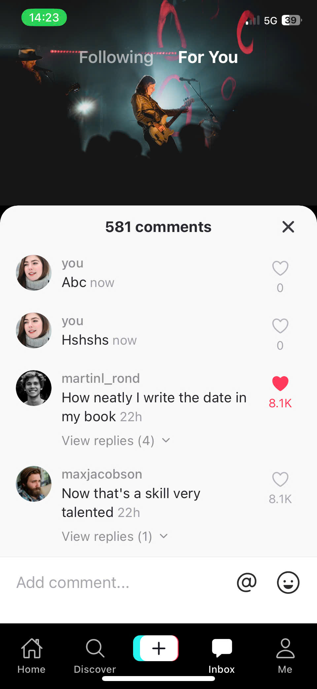

# TikTok UI Exam

## Thông tin sinh viên

- Họ tên: Nguyễn Hoàng Dũng
- MSSV: 23810310338
- Lớp: D18CNPM5

## Mô tả bài làm

Project mô phỏng 3 màn hình TikTok theo file Figma:

- Home (Following)
- Home (For You)
- Comments

Điều hướng được tổ chức như sau:

- `Top Tabs Navigator` để chuyển đổi giữa `Following` và `For You`
- `Bottom Tabs Navigator` để di chuyển giữa `Home` và `Comments`

Chức năng màn hình Comments

Màn hình `Comments` được làm theo hướng gần với trải nghiệm TikTok thực tế:

- Mở màn hình comments khi người dùng nhấn vào icon comment ở cụm action bên phải video
- Giữ lại background video phía sau và hiển thị panel comments từ dưới lên
- Hiển thị danh sách comments với avatar, tên người dùng, thời gian và số tim
- Cho phép like và unlike từng comment
- Cho phép mở và đóng replies của từng comment
- Cho phép nhập comment mới và gửi trực tiếp trong ô `Add comment...`
- Cập nhật tổng số comments sau khi thêm comment mới
- Đóng panel comments để quay về đúng màn hình `Following` hoặc `For You` trước đó

## Hướng dẫn chạy project

1. Cài dependencies:

```bash
npm install
```

2. Chạy Expo:

```bash
npx expo start
```

3. Mở app bằng Expo Go hoặc Android/iOS emulator.

## Cấu trúc thư mục chính

- `App.js`: khai báo navigator và 3 màn hình
- `figma/`: các ảnh export từ Figma được dùng để canh layout
- `screenshots/`: ảnh chụp cho 3 màn hình theo yêu cầu đề bài

## Ảnh chụp màn hình

### Home (Following)


### Home (For You)


### Comments


